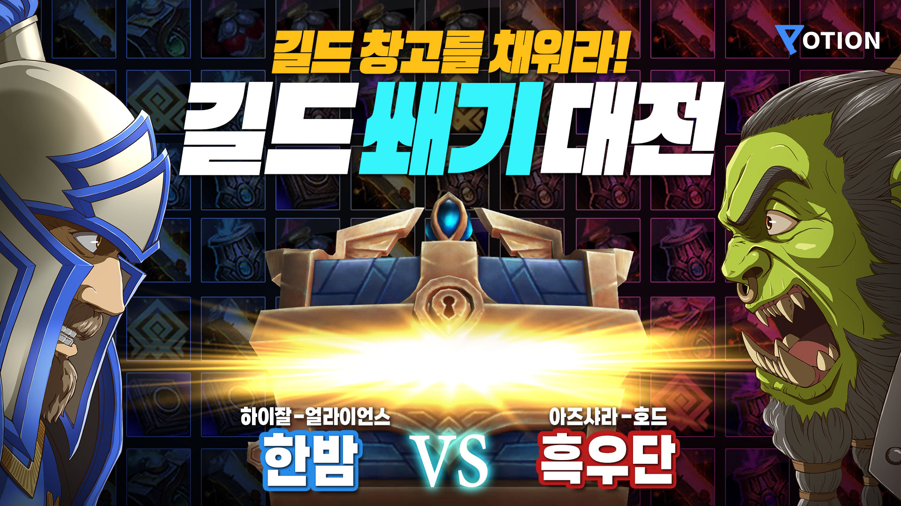

# Black-ox-problem
## *moo~ moo~*
아제로스 최고의 길드 **흑우단**의 알고리즘 도장깨기

## Awards

포션 제 1회 길드 쐐기대전 우승

## Problem list
### BOJ
`C++`
- [1236: 성 지키기](https://www.acmicpc.net/problem/1236)
- [1399: 보물의 위치](https://www.acmicpc.net/problem/1399)
- [1672: DNA 해독](https://www.acmicpc.net/problem/1672)
- [1700: 멀티탭 스케줄링](https://www.acmicpc.net/problem/1700)
- [1715: 카드 정렬하기](https://www.acmicpc.net/problem/1715)
- [25294: 달팽이와 쿼리](https://www.acmicpc.net/problem/25294)

### Programers
`C`
- [42584: 주식가격](https://school.programmers.co.kr/learn/courses/30/lessons/42584)
- [92341: 주차 요금 계산](https://school.programmers.co.kr/learn/courses/30/lessons/92341)
- [135807: 숫자 카드 나누기](https://school.programmers.co.kr/learn/courses/30/lessons/135807)

`C++`
- [12911: 다음 큰 숫자](https://school.programmers.co.kr/learn/courses/30/lessons/12911)
- [12924: 숫자의 표현](https://school.programmers.co.kr/learn/courses/30/lessons/12924)
- [12945: 피보나치 수](https://school.programmers.co.kr/learn/courses/30/lessons/12945)
- [12951: JadenCase 문자열 만들기](https://school.programmers.co.kr/learn/courses/30/lessons/12951)
- [12973: 짝지어 제거하기](https://school.programmers.co.kr/learn/courses/30/lessons/12973)
- [12981: 영어 끝말잇기](https://school.programmers.co.kr/learn/courses/30/lessons/12981)
- [17680: [1차] 캐시](https://school.programmers.co.kr/learn/courses/30/lessons/17680)
- [17681: [1차] 비밀지도](https://school.programmers.co.kr/learn/courses/30/lessons/17681)
- [42628: 이중우선순위큐](https://school.programmers.co.kr/learn/courses/30/lessons/42628)
- [42842: 카펫](https://school.programmers.co.kr/learn/courses/30/lessons/42842)
- [42885: 구명보트](https://school.programmers.co.kr/learn/courses/30/lessons/42885)
- [60057: 문자열 압축](https://school.programmers.co.kr/learn/courses/30/lessons/60057)
- [64064: 불량 사용자](https://school.programmers.co.kr/learn/courses/30/lessons/64064)
- [70129: 이진 변환 반복하기](https://school.programmers.co.kr/learn/courses/30/lessons/70129)
- [86052: 빛의 경로 사이클](https://school.programmers.co.kr/learn/courses/30/lessons/86052)
- [92335: k진수에서 소수 개수 구하기](https://school.programmers.co.kr/learn/courses/30/lessons/92335)
- [118666: 성격 유형 검사하기](https://school.programmers.co.kr/learn/courses/30/lessons/118666)
- [118667: 두 큐 합 같게 만들기](https://school.programmers.co.kr/learn/courses/30/lessons/118667)
- [133501: 야간 전술보행](https://school.programmers.co.kr/learn/courses/30/lessons/133501)
